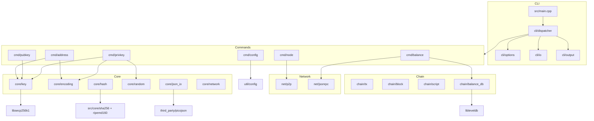
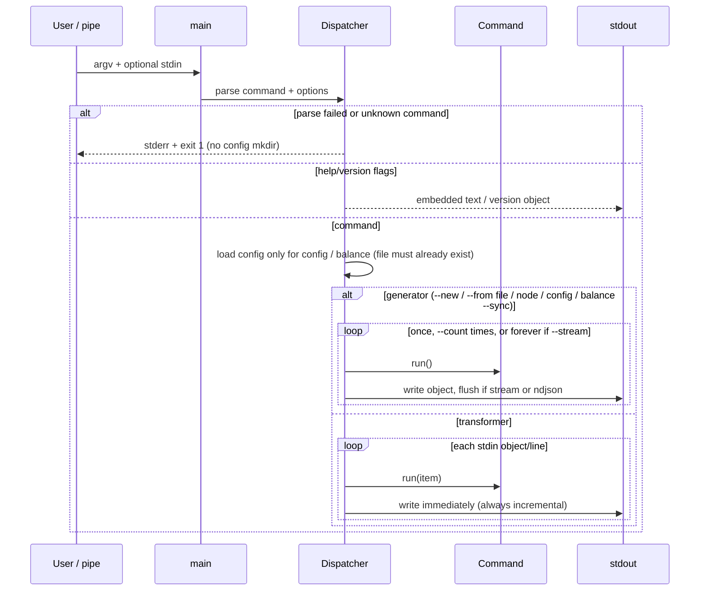
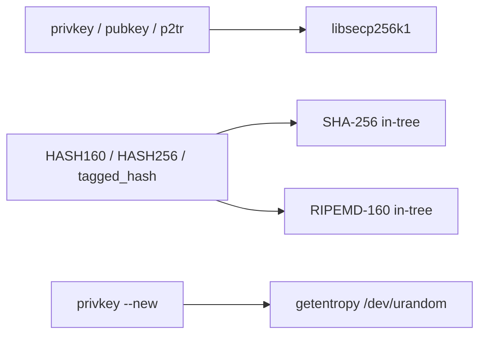

# Bitcoin Toolkit 4.0.0 — Product Design (Greenfield)

| Field | Value |
|---|---|
| **Document** | Product spec + incremental implementation plan |
| **Author** | Bitcoin Toolkit maintainers |
| **Date** | 2026-08-17 |
| **Status** | Phases 0–5 implemented on `4.x` (`privkey`, `pubkey`, `address`, `node`, `balance`). Next: Phase 6 `config`. No `help` or `version` command (`--help` / `--version` only). |
| **Target product** | Bitcoin Toolkit 4.0.0 |
| **Language** | C++17 (GNU Makefile, no Boost, no CMake) |
| **License** | GNU GPL v3 |

This document designs **version 4.0.0 as a new product**. It is not a port of 3.1.2 flags, man pages, tests, error strings, or vendored trees. After the wipe, an engineer implements from **this file alone**. Golden vectors live here, re-derived from Bitcoin consensus rules and published BIPs — not by reference to files that will be deleted.

---

## Overview

Bitcoin Toolkit (`btk`) is a Git-style Unix CLI for a small, composable set of Bitcoin jobs: create and convert private keys, derive public keys, derive addresses, handshake with a P2P peer, maintain a local address→satoshi index, and hold a few RPC/path defaults.

4.0.0 throws away the 3.1.2 implementation (homemade secp256k1, `BUFSIZ` buffers, process-global network, a bag-of-strings JSON array, a misnamed `--bech32m` that was not Taproot). The replacement is a C++17 single binary whose commands speak a **typed object stream** over stdin/stdout. Users compose tools with pipes:

```bash
btk privkey --new | btk pubkey | btk address --type p2wpkh
btk privkey --new --stream | btk address --type p2pkh --match '^1bri'
```

Each line of the default pipe is one JSON object with a `type` field. A `--plain` mode still exists for people who want a bare WIF or address per line. Address types are named after the script they actually produce: `p2pkh`, `p2wpkh`, and **real BIP-341 `p2tr`**. There is no `--bech32m` flag.

---

## Background & Motivation

3.1.2 proved the product shape: a single `btk` binary, Git-style subcommands, Unix pipes, optional Bitcoin Core RPC for balances. It also accumulated accidents that users should not inherit:

| Accident | Why it is not 4.0.0 |
|---|---|
| Homemade EC + mini-gmp, no order check | Consensus-critical math belongs in `libsecp256k1`. A key of `0` or `≥ n` is not a key. |
| JSON array of untyped strings | `["L5…"]` and `["02…"]` look the same. A downstream command has to guess. |
| `--bech32m` = HASH160 + witness v1 | That is not BIP-341. 4.0.0 will not ship a flag that lies about Taproot. |
| Process-global `--testnet` leftover | A mixed list must not infect later items. Network is per object. |
| Balance index hashed the witness serialization (wtxid) as if it were txid | SegWit spends then miss. 4.0.0 uses BIP-141 txid. |
| `btk help` shells out to `man` | There is no `help` command. `btk --help` / `btk <cmd> --help` print embedded text and never exec `man`. |
| Short-opt soup (`-W -X -D -C -U -Q -R`) | Hard to remember, hard to compose. Long options with a tiny, consistent vocabulary. |
| Silent “string → SHA256 → key” guess | A typo’d WIF (WIF-shaped, bad checksum) is still an error. On `privkey`, leftover text is SHA-256’d. `--from text` forces the hash when the string *is* a valid key (`1`). `pubkey` does **not** hash leftover text or files — only an explicit private or public key. `address` / `balance` do **not** silently hash. |

The rebuild is the chance to keep the *jobs* and replace the *contract*.

---

## Goals & Non-Goals

### Goals

- Git-style invocation: `btk <command> [options]`. Item payloads travel on **stdin**, not as leftover argv.
- Unix pipes as the composition mechanism. Default wire format is **typed NDJSON**.
- High-level capabilities: private keys, public keys, addresses (P2PKH / P2WPKH / BIP-341 P2TR), P2P node handshake, embedded help, version, local address-balance index, optional config.
- Vanity / search as a usage pattern: stream keys, filter addresses with `--match`.
- C++17, GNU Makefile, no Boost, no CMake/Conan/vcpkg as a required user step.
- Extremely low dependency count. One required package: `libsecp256k1`. LevelDB optional (balance only).
- Default automated tests are offline.
- An engineer can implement Phase 1 (private keys + the pipe runtime) from this file the day after the wipe.

### Non-Goals

| Item | Reason |
|---|---|
| QR terminal output | Cute, not load-bearing. `btk address --plain \| qrencode -t ANSIUTF8` covers it. No Nayuki tree. |
| Decimal private-key encoding | **Added.** `--encoding dec`; bare `[0-9]+` after WIF and 64-char hex. JSON `data` is a digit string (not a JSON number). |
| Raw binary stdin/stdout (`-R` / `-B`) | Hex in a typed object is the binary escape hatch. No unframed 32-byte dumps in a pipe. |
| Hidden `sbd` input type | Undocumented, not hashed, easy to misuse. |
| Silent passphrase guessing on every command | Only `privkey` hashes leftover text. `pubkey` requires a key (`wif` / hex / `dec` / hex pub). `address` accepts bare WIF or a hex pubkey only; leftover text is an error. A WIF-shaped typo still errors on checksum. |
| `--rehash` / vanity-from-incrementing-hash | Stream new CSPRNG keys instead. |
| HD / BIP-32 / BIP-39 / PSBT / message sign / tx build | Never user-facing; still out of scope. |
| IPv6 P2P, signet, regtest | 4.0.0 node is IPv4 mainnet. `--network` exists for keys/addresses; node ignores it. |
| P2SH / P2WSH *generation* | Address command is key-path only. The balance indexer *does* recognize those scripts when they appear on-chain. |
| Cloning 3.1.2 flags, man pages, tests, or `src/mods/{cJSON,QRCodeGen}` | The wipe deletes them. Do not copy them back. |
| Windows | Unix-only (`getentropy`/`/dev/urandom`, `$HOME`, Makefile install). |
| CMake / Conan / vcpkg as required | Makefile only. |
| Compatibility with 3.1.2 scripts | 4.0.0 is a new CLI. Document a short migration note in the README; do not emulate. |

---

## Key Decisions

| # | Decision | Rationale |
|---|---|---|
| D1 | **Language: C++17, no Boost** | RAII for sockets/files/LevelDB; `std::string`/`std::vector` kill `BUFSIZ`; gcc 7+ / clang 5+. |
| D2 | **Required package: `libsecp256k1`** | Security-critical. Distro-patched. `apt install libsecp256k1-dev` / `dnf install libsecp256k1-devel` / `brew install secp256k1`. No homemade EC. |
| D3 | **Hashes: implement SHA-256 and RIPEMD-160 in-tree** | Avoids OpenSSL 3 legacy-provider hell. ~300 lines, tested against FIPS/Wikipedia vectors below. Not copied from 3.1.2. |
| D4 | **JSON: vendor picojson (fresh download)** | Header-only, BSD-2-Clause, small. See pin in *Third-party pins*. Do **not** copy `src/mods/cJSON`. Parses one complete value: NDJSON/object streams are incremental; a JSON **array** is parsed whole, then walked (Issue: picojson is not a streaming array parser). |
| D5 | **QR: drop** | See Non-Goals. |
| D6 | **Command names stay `privkey` / `pubkey` / `address` / `node` / `balance` / `config`** | They are the domain nouns. Inventing `key`/`addr`/`peer` saves no typing and breaks muscle memory of the *jobs* without improving them. The option language is what changes. There is no `help` or `version` command; use `--help` / `--version`. |
| D7 | **Long options, tiny vocabulary** | `--network`, `--out`, `--in`, `--from`, `--type`, `--new`, `--match`, `--stream`. A handful of shorts (`-h -V -n -o`). No `-W -X -D -Q -R`. |
| D8 | **Default pipe = NDJSON typed objects** | One JSON object per line, `type` discriminator, `fflush` after each object when streaming. Pretty JSON and `--plain` are opt-in. |
| D9 | **Network is per object, never process-global** | WIF version byte sets that item’s network. **Both `privkey` and `pubkey` objects carry `network`.** `--network` applies to generated keys and to hex inputs. Address uses WIF → object `network` → flag → mainnet (never walks `source`). |
| D10 | **Private keys must be in `[1, n-1]`** | `secp256k1_ec_seckey_verify`. Reject 0 and `≥ n`. |
| D11 | **Address `--type p2pkh\|p2wpkh\|p2tr`** | Names the script. Default `p2wpkh` (modern, cheap, universally received). **No `--bech32m` flag.** `p2tr` is BIP-341 key-path, empty script tree. |
| D12 | **Vanity is `--stream` + `--match`** | `btk privkey --new --stream \| btk address --type p2pkh --match '^1bri'`. `--match` includes `source` (the privkey). `--source` forces `source` without `--match`. |
| D13 | **`--from` overrides the stdin guess where the guess is ambiguous; item payloads are never positionals** | Transformers read stdin only (`provide input on stdin`). `--in` is framing; `--from` is meaning; `--encoding` is output. `--from text` is how `1` becomes SHA-256("1") on `privkey`. `pubkey` has no `--from text` / `--from file`; leftover text is an error. `address` has no `--from`: bare lines are only WIF or a hex pubkey. `--from-rpc` and `--from-chainstate` are unknown. `--sync` is RPC (create or catch up). |
| D14 | **Help is embedded `--help`** | `btk --help` and `btk <cmd> --help`. No `help` command. Newly written man pages are optional install artifacts; help does not call `man`. |
| D15 | **Version 4.0.0, GPL-3** | Greenfield break. New tree is GPL-3 throughout (match existing `LICENSE`). `btk --version` emits the typed object. No `version` command. |
| D16 | **`btk node` is IPv4 mainnet, port 8333, 15 s timeout** | Cheap `--network` on node would also need magic bytes + default port; defer. Keys/addresses still take `--network`. |
| D17 | **Balance store is a new LevelDB layout at `~/.btk/balance`** | Address → uint64 LE sats; outpoint → address+amount; metadata for tip/height. BIP-141 txid. Single writer. Progress on stderr. 3.1.2 DBs are not readable. No `--path`. |
| D18 | **Config dump redacts `rpc.auth` as `********`** | Exactly eight asterisks. File mode `0600`. |
| D19 | **Exceptions internally, exit codes at `main`** | `BtkError` with a public message. `main` prints `btk <command>: <message>` on stderr and returns 1. No secrets in messages. |
| D20 | **Default `make test` is offline** | Live P2P only under `BTK_RUN_NET=1` / `make test-net`. |
| D21 | **`--new` not `--create`** | Reads as “make a key”. Used on `privkey` (CSPRNG) only. Balance uses `--sync` (create the index or catch it up). |
| D22 | **TTY does not change the contract** | Default stdout is always NDJSON. No hidden pretty-print when isatty. `--out json` is the human pretty form. |
| D23 | **`--host` (not a leftover argv host) for `node`** | Host/path/port are flags. `config` verbs stay argv. |

---

## Proposed Design

### Architecture

`btk` is one short-lived process. One command per invocation. Composition is the Unix pipe.





**Flush rules (this is the whole streaming contract):**

1. Transformers are **always incremental**. One input item → zero or more output objects, written before the next item is read.
2. `--out ndjson` (default) and `--out plain`: `fflush` after every object / line.
3. `--out json`: buffer into one JSON value (object if 1, array if N) and print at the end, **unless** `--stream` is set, in which case behave as ndjson.
4. Generators emit without reading the object stream. `privkey --new` emits `--count` items (default 1). `--stream` alone is **infinite** until SIGINT. `--stream --count N` is finite N. `privkey --from file` emits exactly one key (SHA-256 of entire stdin).
5. Empty stdin on a **transformer**: print nothing, exit 0. Leftover argv items are an error (`provide input on stdin`).
6. A producer that writes one NDJSON object and sleeps must cause a consumer that is reading an **object stream** (`--in auto` seeing `{`, or `--in ndjson`) to emit before the producer exits. That is the vanity flush test. A pretty JSON **array** (`[…]`) may be parsed as one picojson value and then emitted item-by-item; it is **not** required to yield elements before the producer closes the array.

### Directory layout

```text
bitcoin-toolkit/
├── Makefile
├── LICENSE                          # existing GPL-3 file, kept across the wipe
├── README.md                        # newly written
├── REBUILD.md                       # THIS document (replaces the rejected 3.1.2-compat spec)
├── man/                             # newly written; optional
│   ├── btk.1
│   ├── btk-privkey.1
│   ├── btk-pubkey.1
│   ├── btk-address.1
│   ├── btk-node.1
│   ├── btk-balance.1
│   └── btk-config.1
├── src/
│   ├── main.cpp
│   ├── version.hpp                  # BTK_VERSION_{MAJOR,MINOR,PATCH} = 4,0,0
│   ├── cli/
│   │   ├── dispatcher.cpp / .hpp
│   │   ├── options.cpp / .hpp
│   │   ├── io.cpp / .hpp
│   │   └── output.cpp / .hpp
│   ├── cmd/
│   │   ├── command.hpp
│   │   ├── privkey.cpp
│   │   ├── pubkey.cpp
│   │   ├── address.cpp
│   │   ├── node.cpp
│   │   ├── balance.cpp
│   │   └── config.cpp
│   ├── core/
│   │   ├── hash.cpp / .hpp          # SHA256, RIPEMD160, HASH256, HASH160, tagged_hash
│   │   ├── random.cpp / .hpp
│   │   ├── hex.cpp / .hpp
│   │   ├── base58.cpp / .hpp
│   │   ├── bech32.cpp / .hpp        # bech32 + bech32m
│   │   ├── json_io.cpp / .hpp       # picojson wrap + NDJSON reader
│   │   ├── privkey.cpp / .hpp
│   │   ├── pubkey.cpp / .hpp
│   │   ├── address.cpp / .hpp
│   │   ├── secp.cpp / .hpp          # RAII secp256k1_context
│   │   └── network.hpp              # enum class Network { Main, Test }
│   ├── net/
│   │   ├── p2p.cpp / .hpp
│   │   └── jsonrpc.cpp / .hpp
│   ├── chain/
│   │   ├── compactsize.cpp / .hpp
│   │   ├── script.cpp / .hpp
│   │   ├── transaction.cpp / .hpp
│   │   ├── block.cpp / .hpp
│   │   └── balance_db.cpp / .hpp
│   └── util/
│       ├── error.cpp / .hpp
│       └── config.cpp / .hpp
├── third_party/
│   ├── picojson/
│   │   ├── picojson.h
│   │   └── NOTICE                    # URL, commit, license quote
│   └── README.md                     # how the pins were fetched
└── test/
    ├── runner.py                     # new
    ├── cli/                          # new Python integration, one module per command
    ├── unit/                         # new C++ unit tests, no gtest
    └── fixtures/                     # created during implementation, not copied
```

No `ctrl_mods` / `mods` split. Commands depend on libraries; libraries do not know about CLI flags.

### Third-party pins (fresh vendors — do not copy 3.1.2)

| Library | Role | License | Fetch |
|---|---|---|---|
| **picojson** | JSON parse/serialize | BSD-2-Clause | `https://raw.githubusercontent.com/kazuho/picojson/111c9be5188f7350c2eac9ddaedd8cca3d7bf394/picojson.h` |
| **libsecp256k1** | EC, tweak | MIT | distro package, not vendored |
| **LevelDB** | balance DB | BSD-3-Clause | distro package, optional |

picojson NOTICE (write this file at fetch time):

```text
picojson.h
Source : https://github.com/kazuho/picojson
Commit : 111c9be5188f7350c2eac9ddaedd8cca3d7bf394  (2021-01-17)
License: BSD-2-Clause
URL    : https://raw.githubusercontent.com/kazuho/picojson/111c9be5188f7350c2eac9ddaedd8cca3d7bf394/picojson.h
```

SHA-256 and RIPEMD-160 are **implemented in `src/core/`** from FIPS 180-4 and the RIPEMD-160 spec, with the golden hashes in *Appendix A*. They are not vendored from 3.1.2 and not taken from OpenSSL.

### Build system

GNU Make, single binary `bin/btk`.

```make
CXX      ?= c++
CXXFLAGS ?= -std=c++17 -O2 -Wall -Wextra -Wpedantic -I src -I third_party
LIBS     ?= -lsecp256k1 -lpthread

# Probe libleveldb. If missing, -DBTK_NO_LEVELDB and do not link it.
# libsecp256k1 is required: probe fails → error with the apt/dnf/brew line.
```

Targets: `all`, `test` (unit + offline CLI), `test-unit`, `test-cli`, `test-net`, `install`, `uninstall`, `clean`.

`prefix ?= /usr/local`. Install `bin/btk` and, if present, `man/btk*.1`.

`libsecp256k1` missing:

```text
error: libsecp256k1 is required
  Debian/Ubuntu : sudo apt-get install libsecp256k1-dev
  Fedora        : sudo dnf install libsecp256k1-devel
  macOS         : brew install secp256k1
```

### Command dispatcher

```cpp
// src/cmd/command.hpp
#pragma once
#include <optional>
#include <string>
#include <vector>
#include "cli/options.hpp"
#include "core/json_io.hpp"

class Command {
public:
    virtual ~Command() = default;
    virtual const char* name() const = 0;
    virtual const char* summary() const = 0;
    virtual void register_options(OptionSpec&) const = 0;
    virtual bool is_generator(const Options&) const = 0;
    virtual void init(Options&) {}
    // Transformer: one input object (or bare string wrapped as an object).
    // Generator: called with std::nullopt.
    virtual std::vector<JsonObject> run(const Options&,
                                        const std::optional<JsonObject>&) = 0;
};
```

`main` looks up `argv[1]`. Global flags may appear **before** the command (`btk --config PATH privkey --new`) or after, except `--help`/`--version` which also work with no command.

Unknown command, stderr, exit 1:

```text
btk: unknown command 'foo'
See 'btk --help' for a list of commands.
```

No arguments at all: print the overview help on **stderr**, exit 1 (same idea as git).

`btk --help`: overview on **stdout**, exit 0. There is no `help` command.

`btk --version`: typed `version` object on **stdout**, exit 0. There is no `version` command.

Do not create `~/.btk` on unknown command or failed option parse.

**When config is loaded.** After a successful parse, load `~/.btk/config.json` (or `--config` / `$BTK_CONFIG`) **only** for `config` and `balance`. Phases 1–4 (`privkey`, `pubkey`, `address`, `node`) never open the config file, so a corrupt file cannot break key generation. If the file is missing, those two commands use compiled defaults (no mkdir). If the file exists but is invalid JSON or has a wrong type for a known key: `btk <command>: invalid config file`. Unknown JSON fields on disk are ignored.

**Resolving the config path.** `--config PATH` wins, else `$BTK_CONFIG`, else `$HOME/.btk/config.json`. `--config` and `$BTK_CONFIG` may be relative (cwd). If the resolved path needs `$HOME` and `HOME` is unset: `HOME is not set`. `rpc.auth` is `user:pass` split on the **first** colon (`user` may not contain `:`; `pass` may). No Bitcoin Core cookie file in 4.0.0.

### Option language

One vocabulary across commands.

| Short | Long | Arg | Meaning |
|---|---|---|---|
| `-h` | `--help` | | Print this command’s help, exit 0. |
| `-V` | `--version` | | Print a `version` object, exit 0. |
| | `--config` | path | Config file. Default: `$BTK_CONFIG` if set, else `~/.btk/config.json`. |
| `-n` | `--network` | `mainnet`\|`testnet` | Network for *this* invocation’s generated / hex items. |
| `-o` | `--out` | `ndjson`\|`json`\|`plain` | Output framing. Default `ndjson`. |
| | `--in` | `auto`\|`ndjson`\|`json`\|`plain` | Stdin framing. Default `auto`. |
| `-s` | `--stream` | | Generator: emit until SIGINT. Combined with `--count N`, emit exactly N (finite). Forces per-item flush. |
| `-c` | `--count` | N | Generator: emit N items. Default 1. N must be a positive integer (`≥ 1`). |
| | `--from` | type | Override how **bare stdin lines** are interpreted. Values depend on the command (table below). Not a framing flag (`--in` is). Unknown type: `invalid --from`. |

Per-command additions are listed below. Repeatable flags are called out. Unknown flags are errors.

### Shared input contract

Item **payloads** (keys, addresses) travel on stdin. Flag arguments (`--count 5`, `--type p2tr`, `--host`) stay on argv. `--in` is framing; `--from` is meaning; `--encoding` is output (privkey).

| Kind | Argv | Stdin |
|---|---|---|
| **Transformer** (`privkey`, `pubkey`, `address`, `balance` query) | flags only | items |
| **Generator** (`--new`, `--from file`, `--sync`) | flags only | none, or raw bytes for `--from file` |
| **Parameterized one-shot** (`node`, `balance --sync`) | flags for host/port | none |
| **Verb** (`config`) | `set`/`get`/`unset`/`dump` + keys | none |

`--from` applies to **bare lines**, not to a typed object’s `type`/`data`. Typed objects in the pipe always win. `--from` cannot combine with `--new` or `--sync`. `--from-rpc` and `--from-chainstate` are unknown. `--sync` always walks Core JSON-RPC.

| Command | `--from` values | Bare-line guess | Silent SHA-256 of leftover text? |
|---|---|---|---|
| `privkey` | `wif\|hex\|dec\|text\|file` | WIF → 64-hex → dec → text | **yes** (after guess). `--from text` for `1` |
| `pubkey` | `wif\|hex\|dec` (`hex` = 64-char priv or 66/130-char pub) | WIF → 64-hex priv → dec → 66/130 hex pub | **no**. Error. No `--from text` / `--from file` |
| `address` | none (`--from` is unknown) | WIF → 66/130 hex pub | **no**. Error. Typed `privkey`/`pubkey` objects still work. Bare 64-hex / decimal / leftover text are errors |
| `balance` query | optional `address` | Base58Check / bech32 address | **no** |
| `node` / `config` / `balance --sync` | none | n/a | no |

On a **pipe** (`--in auto`, not a TTY), I/O peeks 8KiB. Binary (NUL, C0 controls other than tab/LF/CR, or invalid UTF-8) is one raw item. `privkey` SHA-256s it (same as `--from file`). Other transformers do not. A TTY stays line-oriented.

`--from text\|wif\|hex\|dec` with `--in auto` is coerced to `--in plain`. `--from file` is a generator: hash entire stdin, do not read the object stream.

`getopt_long` is fine. Prefix `--` stops option parsing. Warn in help that `POSIXLY_CORRECT` stops parsing at the first non-option.

### Typed pipe format

This is the load-bearing contract.

#### Envelope

Every default-mode record is one JSON **object**. Required field:

| Field | Type | Meaning |
|---|---|---|
| `type` | string | `privkey` \| `pubkey` \| `address` \| `node` \| `balance` \| `version` \| `config` |

Unknown `type` on stdin: error, exit 1 (do not guess) **except** where a command lists a type it accepts (below). Extra fields are ignored on input (forward compatible) and must not be invented on output.

**JSON integers.** `sats`, `port`, `height`, `protocol`, `timestamp`, and `rpc.port` are serialized as decimal digit strings with no exponent and no fraction (`5000000000`, never `5e+09`). picojson parse accepts ordinary JSON numbers; we write with a dedicated integer printer, not `stringstream` defaults.

#### `privkey`

```json
{
  "type": "privkey",
  "encoding": "wif",
  "network": "mainnet",
  "compressed": true,
  "data": "KwDiBf89QgGbjEhKnhXJuH7LrciVrZi3qYjgd9M7rFU73sVHnoWn"
}
```

| Field | Values |
|---|---|
| `encoding` | `wif` (default on output), `hex`, or `dec` |
| `network` | `mainnet` \| `testnet` |
| `compressed` | bool. WIF compression flag / “prefer compressed pubkey”. |
| `data` | WIF string, 64 lowercase hex chars (the 32-byte scalar), or a decimal digit string (`encoding=dec`). Hex never includes a trailing `01`/`00` flag — compression is the boolean. Decimal `data` is a JSON string, never a JSON number. |

#### `pubkey`

```json
{
  "type": "pubkey",
  "encoding": "hex",
  "network": "mainnet",
  "compressed": true,
  "data": "0279be667ef9dcbbac55a06295ce870b07029bfcdb2dce28d959f2815b16f81798"
}
```

`data` is 66-char (`02`/`03`) or 130-char (`04`) lowercase hex. `network` is copied from the parent privkey, or from `--network`, or `mainnet` for a bare hex pubkey. Optional `source` (the parent `privkey` or `pubkey` object) only when `--source` is set. Address must **not** walk `source` for network (one level only).

#### `address`

```json
{
  "type": "address",
  "style": "p2wpkh",
  "network": "mainnet",
  "data": "bc1qw508d6qejxtdg4y5r3zarvary0c5xw7kv8f3t4"
}
```

`style`: `p2pkh` \| `p2wpkh` \| `p2tr` \| `p2sh` \| `p2wsh`. The last two appear on **balance** output only (we index them; we do not generate them).

`--match` filters on `data`. Optional `source` is the immediate parent object (privkey or pubkey).

#### `node`

```json
{
  "type": "node",
  "host": "seed.bitcoin.sipa.be",
  "ip": "1.2.3.4",
  "port": 8333,
  "protocol": 70016,
  "user_agent": "/Satoshi:24.0.1/",
  "height": 786299,
  "services": ["NODE_NETWORK", "NODE_WITNESS", "NODE_NETWORK_LIMITED"],
  "relay": true,
  "timestamp": 1682030946
}
```

#### `balance`

```json
{
  "type": "balance",
  "address": "1A1zP1eP5QGefi2DMPTfTL5SLmv7DivfNa",
  "sats": 0
}
```

`sats` is a JSON number (uint64, decimal integer — see above). Unknown address → `0`, not an error.

Query input (stdin), in order:

| Input | Action |
|---|---|
| object `type=address` | query `data` |
| object `type=balance` | re-query `address` |
| object any other `type` | error `expected an address` |
| bare string | parse as a Bitcoin address |

#### `version`

```json
{
  "type": "version",
  "version": "4.0.0",
  "secp256k1": true,
  "leveldb": true
}
```

`leveldb` is whether this binary was linked with LevelDB.

#### `config`

```json
{
  "type": "config",
  "rpc.host": "127.0.0.1",
  "rpc.port": 8332,
  "rpc.auth": "********"
}
```

`rpc.auth` is **always** eight asterisks when present. If unset, the key is omitted.

#### `--out` / `--in`

| Mode | Output | Input |
|---|---|---|
| `ndjson` (out default) | One object, minified, one line, trailing `\n`. | One object per line. Blank lines skipped. |
| `json` | Pretty-printed (2-space) single object, or a pretty array of objects. Trailing `\n`. | One complete picojson value: a single object, or an array of objects/strings. An array is parsed **as a whole** (picojson is not a streaming array parser), then emitted item-by-item. Concatenated top-level objects (`{}{}`) are not required under `--in json`; use `ndjson` / `auto` for that. |
| `plain` | The primary string only, one per line (table below). | One bare string per line. |
| `auto` (in default) | — | Skip leading whitespace. `{` → object stream (read one complete object at a time — vanity). `[` → one JSON array, then walk elements. Else `plain`. |

**`--out plain` primary string**

| Command | Primary |
|---|---|
| `privkey` | `data` (WIF or hex) |
| `pubkey` | `data` (hex) |
| `address` | `data` (address) |
| `balance` | `sats` as decimal digits |
| `--version` | `version` (`4.0.0`) |
| `node` | `ip:port` (example `1.2.3.4:8333`) |
| `config dump` | one `key=value` per line, dotted keys, `rpc.auth=********` |
| `config get` | the raw value only (redacted if `rpc.auth`) |

Transformers do **not** take positional items. A leftover argv word is `provide input on stdin`. (`config` verbs are not items.)

**Bare-string interpretation** (when the command did not get a typed object; `--from` omitted):

| Command | Guess order | Failure / override |
|---|---|---|
| `privkey` | WIF (base58check, version `0x80`/`0xEF`) → 64-char hex → `[0-9]+` decimal → SHA-256(line) | `--from text` forces SHA-256. 64-digit all-numeric is hex. WIF-shaped bad checksum is an error, not a hash. |
| `pubkey` | WIF → 64-char hex privkey → decimal → 66/130-char hex pubkey | `--from wif\|hex\|dec` overrides. `--from hex` is 64-char priv or 66/130-char pub. 64-digit all-numeric is hex priv. A 66- or 130-digit all-numeric string is decimal (guessed before hex pub). No leftover-text or file hash. Fail: `not a private or public key`. |
| `address` | WIF → 66/130-char hex pubkey | error `not a private or public key`. No `--from`. 64-hex / decimal / leftover text are errors. |
| `balance` | A Bitcoin address (Base58Check or bech32/bech32m) | error |

**Bare hex on `address` is a public key.** 66-char (`02`/`03`) or 130-char (`04`) only. 64-hex is not accepted as a bare line — it is neither WIF nor a serialized pubkey, and it is never treated as an x-only internal key. There is no `--from` and no `--from-xonly`. Feed a secret hex/dec as a typed `privkey` object (`printf '<64 hex>' | btk privkey --from hex | btk address`). Feed an x-only key as a `pubkey` object with 66-char `02`/`03` `data`. Negative CLI test: the 64-hex of G’s x-coordinate `79be667ef9dcbbac55a06295ce870b07029bfcdb2dce28d959f2815b16f81798` is `not a private or public key`, and must **not** produce G’s P2TR `bc1pmfr3p9j00pfxjh0zmgp99y8zftmd3s5pmedqhyptwy6lm87hf5sspknck9`. Use secret-1 WIF (or a typed `privkey`) for G’s address.

`--plain` on the producer + `--in plain` (or auto) on the consumer still composes:

```bash
btk privkey --new --out plain | btk address --type p2tr --out plain
```

#### Provenance (`source`)

`source` is the immediate parent object (one level, not a deep chain).

On **`pubkey`**, `source` is omitted unless `--source` is set. `--no-source` is an unknown flag.

On **`address`**, `source` is included when `--match` is set, or when `--source` is set. Otherwise omitted. `--no-source` is an unknown flag. `--source` / `--match` on a typed object copies the parent (one level). On a bare string the source is synthesized:

```json
{"type":"privkey","encoding":"wif","network":"mainnet","compressed":true,"data":"<the-bare-WIF>"}
```

or `{"type":"pubkey","encoding":"hex",…}` if the bare string was a 66/130-char hex pubkey. The synthetic `data` is the bare input; do not re-encode.

Vanity relies on `--match` implying `source`:

```bash
btk privkey --new --stream | btk address --type p2pkh --match '^1bri'
```

```json
{"type":"address","style":"p2pkh","network":"mainnet","data":"1BRi…","source":{"type":"privkey","encoding":"wif","network":"mainnet","compressed":true,"data":"L3Uq…"}}
```

Pipe `privkey | pubkey | address --source` if you want the pubkey as `source` without `--match` (not spendable from the address object alone). Vanity should be `privkey | address --match`.

### Error handling

| Code | When |
|---|---|
| 0 | Success, including “`--match` filtered everything” (empty stdout). |
| 1 | Any error. |
| 130 | SIGINT on a `--stream` generator (optional; if the runtime reports 130, fine; if it reports 0 after a clean unwind, also fine — tests must not require 130). |

Stderr, one line preferred:

```text
btk privkey: invalid WIF checksum
btk address: uncompressed key cannot produce p2wpkh or p2tr
btk node: connect timed out after 15s
```

Rules:

- Prefix is `btk <command>:` — never echo stdin payloads (they may be secrets).
- No WIF, hex keys, passphrases, or `rpc.auth` values in messages.
- Validation wording is specified per command below so tests can assert it.

RAII owners: `SecpContext`, `Socket`, `LevelDb`, `LevelIter`, `LevelBatch`, `File`. Destructors run on exception unwind.

---

## Commands

### 1. `btk privkey` — Phase 1

Create a private key from the CSPRNG, convert encodings, or derive a key from explicit bytes.

```text
btk privkey --new [--count N] [--stream]
            [--encoding wif|hex|dec] [--network mainnet|testnet]
            [--compressed | --uncompressed]
btk privkey [--encoding wif|hex|dec] [--network mainnet|testnet]
            [--compressed | --uncompressed]
            [--from wif|hex|dec|text|file]
```

| Long | Notes |
|---|---|
| `--new` | 32 CSPRNG bytes, then `secp256k1_ec_seckey_verify`; retry on failure (p ≈ 2⁻¹²⁸). Default compressed, mainnet, WIF. **Generator:** does not read the object stream. |
| `--encoding` | Output encoding: `wif` (default), `hex`, or `dec`. |
| `--compressed` / `--uncompressed` | Set the compression flag. If **both**, emit two objects (compressed first). Default compressed. |
| `--from` | Force stdin interpretation: `wif`, `hex`, `dec`, `text` (SHA-256 each line), or `file` (SHA-256 entire stdin, one key). Default: guess. Cannot combine with `--new`. |
| `--count N` | Only with `--new`. Emit N keys. Default 1. N must be `≥ 1`. |
| `--stream` | Only with `--new`. Alone: emit until SIGINT. With `--count N`: emit N, then stop. |

`--new` and `--from` cannot be combined (`cannot combine --new and --from`).

Without `--new`, this command is a **transformer** on stdin (no positional keys: `provide input on stdin`). Each stdin object/line is parsed as WIF, 64-char hex, or a decimal digit string (see guess order). Anything else is SHA-256'd as text. Piped binary (`--in auto`) is hashed whole. `--from` overrides the guess. `--from file` is a generator (hashes entire stdin once). `--encoding` selects the output encoding. `--network` re-encodes WIF to that network (hex/dec items pick up `--network`, default mainnet). `--compressed` / `--uncompressed` flip the flag.

**Illegal combinations**

| Combo | Error |
|---|---|
| `--new` + `--from` | `cannot combine --new and --from` |
| `--count` without `--new` | `--count requires --new` |
| `--stream` without `--new` | `--stream requires --new` |
| `--count 0` or negative or non-integer | `invalid --count` |
| positional items | `provide input on stdin` |
| `--from` not `wif\|hex\|dec\|text\|file` | `invalid --from` |

**Reject:** scalar `0` or `≥ n`. Message: `private key out of range`. Bad WIF checksum: `invalid WIF checksum`. Bad hex length: `invalid hex private key`. Bad decimal (sign, `0x`, empty, non-digits): `invalid decimal private key` when `encoding=dec`; otherwise a guess-order miss (not WIF-shaped, not 64-hex, not digits) is SHA-256'd as text.

Decimal emit has no leading zeros (`1`, not `01`). Parse strips leading zeros (`001` is secret 1). A 64-digit all-numeric bare string is hex (guess step 2), not decimal; force decimal with a typed object `"encoding":"dec"`.

CSPRNG: `getentropy(buf, 32)` if available (`<sys/random.h>`), else read exactly 32 bytes from `/dev/urandom`. Short read is fatal: `could not read CSPRNG`.

WIF:

- Payload: `version || 32-byte scalar || [0x01 if compressed]`.
- Version: mainnet `0x80`, testnet `0xEF`.
- Checksum: first 4 bytes of HASH256(payload).
- Base58. Leading `5` / `K`/`L` (main) and `9` / `c` (test) fall out of the version byte; do not pattern-match the first character as the decoder.

Hex output is lowercase. Hex input is case-insensitive.

`--from text` / `--from file` (and silent leftover-text / binary hash) is always treated as a compressed mainnet key unless flags say otherwise.

### 2. `btk pubkey` — Phase 2

Derive a public key from an explicit private key, or recompress a public key.

```text
btk pubkey [--compressed | --uncompressed]
           [--from wif|hex|dec] [--source]
```

Stdin only (`provide input on stdin` if leftover argv). Input: `privkey` object, `pubkey` object, or a bare line that is already a key (see Shared input contract).

- From a private key (typed `privkey`, or a bare WIF / 64-char hex / decimal string): `secp256k1_ec_pubkey_create` + `secp256k1_ec_pubkey_serialize`.
- From a public key (typed `pubkey`, or a bare 66/130-char hex string): `secp256k1_ec_pubkey_parse` + serialize in the requested form.

Do **not** invent a secret. Leftover text is not SHA-256’d. There is no `--from text` or `--from file`. Binary stdin is not hashed. `--from` is only `wif`, `hex`, or `dec` — a plain private-key string, or (`--from hex`) a plain public-key hex string. Unknown `--from`: `invalid --from`.

Bare-line guess (when `--from` is omitted): WIF → 64-char hex privkey → decimal → 66/130-char hex pubkey. `--from` overrides that guess. `--from hex` accepts 64-char priv or 66/130-char pub. 64-digit all-numeric is hex priv (same as `privkey`). A 66- or 130-digit all-numeric string is decimal, because decimal is guessed before hex pub.

Default compression: follow the input’s `compressed` field / WIF flag / existing prefix; if none, compressed. `--compressed` / `--uncompressed` override. Both flags → two objects.

Output `encoding` is always `hex`. `network` on the output object: from a typed input’s `network`; else from a WIF version byte; else `--network`; else `mainnet`.

Message on bad input when `--from` is a key type, when a typed object is the wrong `type`, or when a bare line matches no guess: `not a private or public key`. `--match` is an unknown flag here. `--source` includes the parent key (`source`); without it the field is omitted. On a bare string, `--source` synthesizes a `privkey` or `pubkey` object (data is the bare input). `--no-source` is unknown here.

### 3. `btk address` — Phase 3

```text
btk address [--type p2pkh|p2wpkh|p2tr]...
            [--network mainnet|testnet]
            [--match REGEX] [--ignore-case]
            [--source]
```

| Long | Notes |
|---|---|
| `--type` | Repeatable. Default: one `p2wpkh`. Order of emission = order of flags. Unknown style: `unknown address type`. |
| `--match` | POSIX ERE on the address `data`. Inclusive. Once. **Address only** (unknown flag on every other command). Implies `--source`. |
| `--ignore-case` | Adds `REG_ICASE`. Address only. |
| `--source` | Include a `source` object (typed parent, or a synthesized object for a bare string). Implied by `--match`. |

`--match` compilation: `regcomp(pattern, REG_EXTENDED | REG_NOSUB [| REG_ICASE])` with the C locale in effect (`setlocale(LC_CTYPE, "C")` and `LC_COLLATE` C before `regcomp`, or `newlocale`/`uselocale` so `LC_COLLATE` cannot change `^1bri`). Invalid pattern: exit 1, `invalid match pattern`. `regexec` uses the same locale.

**Scripts**

| `--type` | Construction | HRP / version |
|---|---|---|
| `p2pkh` | Base58Check(`ver \|\| HASH160(serialized pubkey)`). `ver` = `0x00` main / `0x6F` test. Pubkey serialization follows the item’s compressed flag. | `1…` / `m…`/`n…` |
| `p2wpkh` | Bech32 (BIP-173), witness v0, 20-byte HASH160(**compressed** pubkey). | `bc` / `tb` |
| `p2tr` | Bech32m (BIP-350), witness v1, 32-byte **tweaked** x-only output key. BIP-341 key-path, empty script tree. | `bc` / `tb` |

Uncompressed key + `p2wpkh` or `p2tr`: error `uncompressed key cannot produce p2wpkh or p2tr`. (P2PKH of an uncompressed key is allowed.)

No `--bech32m` name. No HASH160-as-v1 path.

**BIP-341 `p2tr` algorithm (empty script tree):**

1. Require a compressed (or compressible) pubkey. Take `X` = the 32-byte x-coordinate. The `02`/`03` prefix is ignored except to parse `X`. Same `X` → same address (`lift_x` uses even Y, BIP-340).
2. Internal key `P = lift_x(X)`.
3. `t = int(tagged_hash("TapTweak", X))` where `tagged_hash(tag, msg) = SHA256(SHA256(tag) \|\| SHA256(tag) \|\| msg)`. Empty Merkle root: do **not** append a script-root. If `t ≥ n`, error `taproot tweak out of range`.
4. `Q = P + t·G`. Use `secp256k1_xonly_pubkey_parse` + `secp256k1_xonly_pubkey_tweak_add`, or `secp256k1_keypair_xonly_tweak_add` from a secret.
5. Program = `x(Q)` (32 bytes). Encode witness version 1 with **bech32m** (checksum xor constant `0x2bc830a3`). HRP from the item’s network.
6. A `p2tr` address is 62 characters (`bc1p` + 58). It is **not** a 42-character HASH160 bech32m string.

A compressed `03` key (odd Y) must produce the same address as the `02` key with the same X. Appendix A.2b is the odd-Y golden; A.2 / A.6 are even-Y.

**Network on `address`**, first match wins — do **not** walk `source`:

1. Input is WIF (bare or `privkey` with `encoding=wif`) → version byte.
2. Typed object has `network` → that value (`privkey` or `pubkey`).
3. `--network` flag.
4. `mainnet`.

**Bare lines are WIF or a hex pubkey.** Guess: WIF (base58check, 33/34-byte payload, version `0x80`/`0xEF`) → 66/130-char hex public key. There is no `--from`; the two shapes do not overlap. `--from` is `unknown option '--from'`. Typed `privkey` / `pubkey` objects always work (any encoding on the object). 64-hex, decimal, leftover text, and binary stdin are `not a private or public key`. 64-hex is never an x-only internal key. Feed a secret hex/dec as a typed `privkey` object. Feed an x-only key as a `pubkey` object with 66-char `02`/`03` `data`. A WIF-shaped string with a bad checksum is `invalid WIF checksum`. Stdin only; leftover argv is `provide input on stdin`.

**Illegal combinations:** `--match` more than once → `cannot pass --match more than once`. `--stream` is accepted as “flush each output” (no-op; transformers already flush). `--count` and `--from` are unknown.

### 4. `btk node` — Phase 4

```text
btk node --host HOST [--port 8333]
```

IPv4 TCP only. Default port 8333. DNS via `getaddrinfo` (`AF_INET`). 15 second `SO_SNDTIMEO` / `SO_RCVTIMEO` (and/or `poll`) on connect and read.

**Host selection:** `--host` is required. Missing → `missing host`. A leftover positional is `provide input on stdin` (hosts are flags, not item payloads). If `--host` contains `:`, the suffix is the port (IPv4 only, so one colon). `--port` plus a `--host` that already has `:port` → `port specified twice`.

Handshake: send `version`, read the peer’s `version`, print the object, close. Do **not** send `verack`. One shot; `--stream` is an error (`node does not stream`).

`--out plain` prints `ip:port`. `--verbose` adds `raw` with `addr_recv`, `addr_trans`, `nonce` (decimal digit string — a uint64 nonce does not fit in a JSON number), `services_bits`.

**`version` payload layout** (all multi-byte integers little-endian **except** `addr_*` ports):

| Offset | Size | Field | We send |
|---|---|---|---|
| 0 | 4 | `version` int32 LE | `70015` (`7f 11 01 00`) |
| 4 | 8 | `services` uint64 LE | `0` |
| 12 | 8 | `timestamp` int64 LE | `time(NULL)` at runtime; tests use the frozen hex below |
| 20 | 8 | `addr_recv.services` uint64 LE | `0` |
| 28 | 16 | `addr_recv.ip` | IPv4-mapped `127.0.0.1` = `00 00 00 00 00 00 00 00 00 00 ff ff 7f 00 00 01` |
| 44 | 2 | `addr_recv.port` | **network byte order (BE)** `8333` = `20 8d` |
| 46 | 8 | `addr_trans.services` uint64 LE | `0` |
| 54 | 16 | `addr_trans.ip` | same as recv |
| 70 | 2 | `addr_trans.port` | **BE** `20 8d` |
| 72 | 8 | `nonce` uint64 LE | `0` |
| 80 | 1+ | `user_agent` | Bitcoin `var_str` = **CompactSize** (not Core VARINT) + bytes. We send CompactSize `17` + `/Bitcoin-Toolkit:4.0.0/` |
| 104 | 4 | `start_height` int32 LE | `0` |
| 108 | 1 | `relay` bool | `0` |

Payload length = 109. Inbound parse uses the same layout (variable UA length).

**Frozen unit-test vector** (timestamp `1700000000`, nonce `0` — tests **must not** call `time(NULL)`):

Full message including 24-byte header (magic `f9beb4d9`, command `version` + 5 NULs, length `6d000000`, checksum `d2a9d2ea`):

```
f9beb4d976657273696f6e00000000006d000000d2a9d2ea7f110100000000000000000000f1536500000000000000000000000000000000000000000000ffff7f000001208d000000000000000000000000000000000000ffff7f000001208d0000000000000000172f426974636f696e2d546f6f6c6b69743a342e302e302f0000000000
```

Payload only (109 bytes):

```
7f110100000000000000000000f1536500000000000000000000000000000000000000000000ffff7f000001208d000000000000000000000000000000000000ffff7f000001208d0000000000000000172f426974636f696e2d546f6f6c6b69743a342e302e302f0000000000
```

P2P framing (mainnet only): magic on the wire `f9 be b4 d9`; 12-byte command; uint32 LE length; checksum = first 4 of HASH256(payload).

**Service bits:** 0 `NODE_NETWORK`, 1 `NODE_GETUTXO`, 2 `NODE_BLOOM`, 3 `NODE_WITNESS`, 4 `NODE_XTHIN`, 6 `NODE_COMPACT_FILTERS`, 10 `NODE_NETWORK_LIMITED`. Every other set bit is listed as `BIT_<n>` (decimal n). Named and `BIT_<n>` entries appear in ascending bit order. Do not omit unknown bits.

### Help and version (not commands)

`btk --help` and `btk <command> --help` print Appendix C bodies. There is no `help` command. Newly written man pages wrap the same text. `make install` installs them. Help never execs `man`.

`btk --version` emits the typed `version` object. `--out plain` prints `4.0.0`. There is no `version` command.

### 5. `btk balance` — Phases 5a–5c

Local address → satoshi index. The only writer is Bitcoin Core JSON-RPC. `--sync` walks RPC: first run creates the index, later runs catch it up. The index always lives at `~/.btk/balance`. `--path`, `--from-rpc`, `--from-chainstate`, `--chainstate`, `--build`, and `--update` are unknown options.

```text
btk balance                                          # query stdin
btk balance --sync [--host H] [--port P] [--rpc-auth USER:PASS]
```

| Long | Default |
|---|---|
| `--host` / `--port` | config `rpc.host` / `rpc.port` or `127.0.0.1` / `8332` |
| `--rpc-auth` | config `rpc.auth` (form `user:pass`; we Base64 at request time). No cookie file. |
| `--force` | Only with `--sync`. Wipe `~/.btk/balance` and walk from genesis. |

Query is a **transformer** on stdin (no positional addresses: `provide input on stdin`). `type=address` → `data`; `type=balance` → `address`; bare string → parse as address. Empty stdin → empty stdout, exit 0. Query does **not** open a write handle. Missing address → `sats: 0`. Missing database → `balance database not found (run btk balance --sync)`. Do not SHA-256 leftover text.

**`--sync`**

| State of `~/.btk/balance` | Action |
|---|---|
| Missing, or empty directory | Create the DB and walk heights `0 … tip` |
| Valid index (`Mheight` and `Mtip` present) | Walk `Mheight+1 … tip`. Already at tip → `complete` and exit 0 |
| Non-empty directory without valid metadata | `balance database exists; rebuild with --sync --force` |
| `--force` (any of the above) | Wipe the directory and walk `0 … tip` |

A valid index whose stored hash at `Mheight` does not match the RPC block hash at that height: `reorg detected; rebuild with --sync --force`.

**Illegal combinations**

| Combo | Error |
|---|---|
| `--force` without `--sync` | `--force requires --sync` |

Progress goes to **stderr** so pipes stay clean:

```text
syncing: height 800000/850000 (94.1%)
complete: height 850000
```

`\r` on the progress line is fine. Final `complete` line ends with `\n`.

#### Storage (new layout — not compatible with 3.1.2)

LevelDB, directory `~/.btk/balance`. The writer library may take a directory for tests; the CLI never does.

| Key | Value |
|---|---|
| `A` \|\| UTF-8 address | `uint64` satoshis, little-endian |
| `O` \|\| 32-byte txid (internal/LE) \|\| `uint32` vout LE | CompactSize(addr len) \|\| addr \|\| `uint64` amount LE |
| `Mheight` | `uint32` LE last consumed height |
| `Mtip` | 32-byte tip hash (internal) |

`A` is the query path. `O` is the UTXO/outpoint map so an incremental `--sync` can debit the right address when an input spends. The RPC writer uses this layout.

**txid is BIP-141:** HASH256 of the **non-witness** serialization (`nVersion || vin || vout || nLockTime`). Never hash marker/flag/witness. Display-hex txids in logs are byte-reversed; keys store internal order.

#### Who gets an `A` row

Extract a standard address from `scriptPubKey`:

| Script | Address |
|---|---|
| `OP_DUP OP_HASH160 20 <h> OP_EQUALVERIFY OP_CHECKSIG` | P2PKH |
| `OP_HASH160 20 <h> OP_EQUAL` | P2SH (index only) |
| `OP_0 20 <h>` | P2WPKH |
| `OP_0 32 <h>` | P2WSH (index only) |
| `OP_1 32 <x>` | P2TR: encode the 32-byte `x` **as-is** (bech32m v1). Do **not** apply a BIP-341 tweak — the program on chain is already the output key. |
| `<33/65-byte pubkey> OP_CHECKSIG` | P2PKH of that pubkey (historical P2PK) |

Anything else is skipped (not an error). Network for encoding follows the node we are indexing: **mainnet** in 4.0.0. (Testnet index is a later `--network` on `--sync`.)

**Bitcoin CompactSize** (P2P / blocks / txs / `var_str`):

| n | Encoding |
|---|---|
| `< 253` | 1 byte `n` |
| `≤ 0xffff` | `0xfd` + uint16 LE |
| `≤ 0xffffffff` | `0xfe` + uint32 LE |
| else | `0xff` + uint64 LE |

Goldens: `0 → 00`, `23 → 17`, `252 → fc`, `253 → fd fd 00`. Do **not** implement Bitcoin Core’s chainstate VARINT — it is a different encoding and unused in 4.0.0.

#### Block and tx layout (needed for RPC `--sync` and BIP-141 txid)

Block: `int32 version | 32-byte prev | 32-byte merkle | uint32 time | uint32 bits | uint32 nonce | CompactSize tx_count | tx…`.

Transaction:

```
int32 nVersion
[if dummy vin CompactSize == 0 and flags != 0: marker 0x00, flag, then real vin]
CompactSize vin_count
repeat vin: 32-byte prev txid (internal) | uint32 vout | CompactSize scriptsig | uint32 sequence
CompactSize vout_count
repeat vout: int64 value | CompactSize spk | spk
[if flag & 1: per-input witness = CompactSize item_count, each item CompactSize+bytes]
uint32 nLockTime
```

**BIP-141 txid** = HASH256(`nVersion || vin || vout || nLockTime`) — strip marker, flag, and every witness. **wtxid** = HASH256(the full serialization). Appendix A.10 is the frozen pair.

#### Sync from RPC

HTTP/1.0 or 1.1, `Content-Type: application/json`, `Authorization: Basic <base64(user:pass)>`.

Methods:

- `getblockcount` → tip height
- `getblockhash height` → hash
- `getblock hash 0` → raw block hex (we parse; one code path, our BIP-141 txid)

`--sync` without `--force`: if there is no valid index, walk `0 … tip`; if there is, check the RPC hash at `Mheight` against `Mtip` and walk `Mheight+1 … tip`. `--sync --force` always walks `0 … tip`. A genesis walk needs a Core node that can serve every historical block (`getblock … 0`); a pruned node cannot complete it. A mainnet first sync takes days — that is accepted. Later `--sync` runs are incremental.

For each block, for each tx, for each input (skip coinbase): look up `O[prevout]`; if found, debit that address by that amount (floor at 0) and delete the outpoint. A missing prevout is skipped with no warning — we never store non-standard / unaddressable scripts, so those spends are expected. For each output with a recognized address: credit `A[addr]`, write `O[this_outpoint]`.

**Concurrency:** one fetch thread, one parse thread, one DB-writer thread. Shared queue of parsed block effects, mutex + condvar, max depth 100. No lock-free shared lists.

LevelDB missing at compile time: the command prints `btk balance: this build was compiled without LevelDB (install libleveldb-dev and rebuild)` and exits 1.

### 6. `btk config` — Phase 6

```text
btk config set <key>=<value>
btk config unset <key>
btk config get <key>
btk config dump
```

Allowed keys:

| Key | Meaning |
|---|---|
| `rpc.host` | JSON-RPC host |
| `rpc.port` | JSON-RPC port (integer) |
| `rpc.auth` | `user:pass` |

File: `$BTK_CONFIG` or `--config` or `~/.btk/config.json`. Nested JSON. Types: `rpc.host` string, `rpc.port` JSON number (integer 1–65535), `rpc.auth` string. Unknown keys on disk are ignored. Unknown keys on `set`/`unset`/`get`: `unknown config key 'foo'`. There is no `balance.path` or `chainstate.path`. The index is always `~/.btk/balance`.

Create the file (mode `0600`) and parents (`0700`) only on `set`. Missing file:

- `dump` → a `config` object with no data keys (only `"type":"config"`). No mkdir. Exit 0.
- `get <key>` → `no such key` (even if the key name is valid). No mkdir. Exit 1.
- `unset` → `no such key`. No mkdir. Exit 1.

`get <key>` when the file exists: `--out plain` of the raw stored value (so `get rpc.port` prints `8332`). `get rpc.auth` prints `********`. Missing key in an existing file: `no such key`.

`dump` always emits the typed `config` object (dotted keys). `--out plain` is one `key=value` per line. `rpc.auth` is **always** eight asterisks when present; omitted when unset. No `--show-secrets`. No cookie file in 4.0.0.

On-disk example (`~/.btk/config.json`):

```json
{
  "rpc": {
    "host": "127.0.0.1",
    "port": 8332,
    "auth": "alice:s3cret"
  }
}
```

Corresponding `btk config dump` (ndjson):

```json
{"type":"config","rpc.host":"127.0.0.1","rpc.port":8332,"rpc.auth":"********"}
```

Corresponding `--out plain`:

```
rpc.host=127.0.0.1
rpc.port=8332
rpc.auth=********
```

---

## Crypto



**libsecp256k1**

- `secp256k1_context_create(SECP256K1_CONTEXT_NONE)` (or `SIGN\|VERIFY` on older headers).
- `secp256k1_ec_seckey_verify`, `secp256k1_ec_pubkey_create`, `secp256k1_ec_pubkey_parse` / `serialize`.
- Taproot: `secp256k1_xonly_pubkey_parse`, `secp256k1_xonly_pubkey_tweak_add`. Link `-lsecp256k1`. Extra extrakeys module is in the default distro package.

**Curve order**

```
n = FFFFFFFFFFFFFFFFFFFFFFFFFFFFFFFEBAAEDCE6AF48A03BBFD25E8CD0364141
```

**Hashes to implement** (test against Appendix A):

- `SHA256(msg)` — FIPS 180-4
- `RIPEMD160(msg)`
- `HASH256(msg) = SHA256(SHA256(msg))`
- `HASH160(msg) = RIPEMD160(SHA256(msg))`
- `tagged_hash(tag, msg)` as BIP-340

No GMP. 32-byte scalars are `std::array<uint8_t,32>`. Compare to `n` via `secp256k1_ec_seckey_verify` rather than a home-rolled bigint, except WIF/hex parse which only needs a 32-byte buffer.

---

## API / Interface Changes

There is no 3.1.2 compatibility surface. Migration for humans (README):

| 3.1.2 | 4.0.0 |
|---|---|
| `btk privkey --create` | `btk privkey --new` |
| `btk privkey --create --stream \| btk address --trace --grep='^1bri'` | `btk privkey --new --stream \| btk address --type p2pkh --match '^1bri'` |
| `btk address --bech32` | `btk address --type p2wpkh` (default) |
| `btk address --legacy` | `btk address --type p2pkh` |
| `btk address --bech32m` | **removed** (was not Taproot). Use `--type p2tr`. |
| `btk address --p2tr` (if anyone used a patch) | `btk address --type p2tr` |
| `btk node --hostname=X` | `btk node --host X` |
| `btk privkey "passphrase"` | `printf passphrase \| btk privkey` or `printf passphrase \| btk privkey --from text` |
| `cat photo.jpg \| btk privkey --in-type=binary` | `cat photo.jpg \| btk privkey` or `cat photo.jpg \| btk privkey --from file` |
| `--out-format=list` | `--out plain` |
| `--testnet` | `--network testnet` |
| JSON array of strings | typed objects |

Worked pipes:

```bash
# key → pubkey → address (typed objects)
btk privkey --new | btk pubkey | btk address --type p2wpkh

# same, bare strings (privkey --out plain is WIF; hex/dec --out plain does not feed address)
btk privkey --new --out plain | btk address --type p2tr --out plain

# both compressions of one secret
btk privkey --new --compressed --uncompressed

# convert WIF → hex
printf '%s' KwDiBf89QgGbjEhKnhXJuH7LrciVrZi3qYjgd9M7rFU73sVHnoWn | btk privkey --encoding hex

# vanity (prints the matching address + source privkey)
btk privkey --new --stream | btk address --type p2pkh --match '^1bri'

# taproot vanity
btk privkey --new --stream | btk address --type p2tr --match '^bc1p73'

# node
btk node --host seed.bitcoin.sipa.be

# balance
btk balance --sync
printf '%s' 1A1zP1eP5QGefi2DMPTfTL5SLmv7DivfNa | btk balance
```

---

## Data Model Changes

No 3.1.2 database is migrated.

- **Config:** `~/.btk/config.json` (new path vs `~/.btk/btk.conf`). Nested JSON. Mode 0600.
- **Balance:** `~/.btk/balance/` LevelDB as specified. `--sync` from Core JSON-RPC only (create or catch up). 3.1.2 TXOA files are trash after the wipe.
- **No in-tree fixture copied from `test/balance/`.** Phase 5 tests create a tiny DB with the new writer and query it.

---

## Alternatives Considered

### A. Keep 3.1.2 CLI, rewrite internals

**Pros:** existing scripts survive. **Cons:** locks in `--bech32m` lying about Taproot, untyped string arrays, short-opt soup, silent passphrase hashing. The previous spec took this path and was rejected. **Not chosen.**

### B. Subcommand groups (`btk key new`, `btk chain tip`)

**Pros:** git-like grouping, room to grow. **Cons:** Phase order is one *command* per phase (privkey, pubkey, address…). Extra nesting without extra jobs. **Not chosen for 4.0.0.** Revisit if HD/PSBT ever land.

### C. Default pretty JSON array + optional NDJSON

**Pros:** prettier screenshots. **Cons:** arrays are hostile to streaming; vanity then needs flush archaeology. **Not chosen.** Default NDJSON; `--out json` is the pretty form.

### D. Vendor nlohmann/json or write a parser from scratch

nlohmann is a 20k-line single header. A from-scratch parser is a bug magnet for a CLI that accepts user JSON. **picojson** is ~1k lines, header-only, BSD-2-Clause. **Chosen.**

### E. Optional OpenSSL for hashes

3.1.2 already paid for this (legacy provider, Makefile probes). Two hash functions are small and well-specified. **In-tree hashes chosen.**

### F. Keep terminal QR

Requires a vendor (Nayuki) for a feature `qrencode` already does. **Dropped.**

### G. Fresh cJSON vs picojson

The wipe forbids *copying* `src/mods/cJSON`; it does not ban cJSON as a project. A new download of Dave Gamble’s cJSON would work. picojson is one header, no `.c` to compile, BSD-2-Clause, and matches our tiny schema. **picojson chosen.**

### H. SQLite vs LevelDB for the new balance store

SQLite would give SQL and one file. LevelDB is a small optional package (`libleveldb-dev`) with the same kv/batch style the index needs (`A` / `O` / metadata). We do not read Core’s chainstate in 4.0.0, so sharing a decoder with that format is not a reason. **LevelDB chosen.**

### I. RPC-only balance (skip the chainstate parser)

A mainnet first `--sync` walks every hex block and takes days; a pruned node cannot serve genesis. That cost is accepted: 4.0.0 does not parse Core’s UTXO set (no VARINT, obfuscation, or `Coin` compression). **`--sync` is the only writer** (create or catch up). `--build`, `--update`, `--from-rpc`, `--from-chainstate`, and `--path` are unknown.

### J. Core cookie file vs `user:pass`

Core’s default RPC auth is a cookie at `~/.bitcoin/.cookie`. Convenient, but another path + race with a running node. 4.0.0 stores `rpc.auth=user:pass` (first-colon split) and Base64s it at request time. **No cookie file.**

---

## Security & Privacy

| Threat | Severity | Mitigation |
|---|---|---|
| Invalid scalar (`0`, `≥ n`) accepted as a key | High | `secp256k1_ec_seckey_verify` on generate and parse. |
| Homemade EC bugs | High | Only libsecp256k1 multiplies points. |
| Secrets on stderr / in argv traces | High | Error prefix is command name only. Never echo WIF/hex/passphrases/`rpc.auth`. |
| Config file world-readable | High | `0600` on the file, `0700` on `~/.btk`. |
| `config dump` leaking RPC password | High | Always `********`. `get rpc.auth` redacts too. |
| `--from text` / leftover-text hash used as a brainwallet | Medium | Allowed on `privkey` only. `pubkey` and `address` do not hash leftover text or files. `address` has no `--from`. README warns: SHA-256(passphrase) is not a KDF. |
| CSPRNG failure ignored | High | Short `getentropy`/`urandom` read is fatal. |
| Balance data race / torn writes | Medium | Single writer thread, LevelDB write batches. |
| wtxid used as outpoint | High | BIP-141 non-witness txid only. |
| Reorg silently corrupts the index | Medium | Tip-hash check on incremental `--sync`; refuse and demand `--sync --force`. |
| SSRF via `btk node` / RPC host | Low | User-supplied host; no URL fetch. IPv4 only. |
| Regex ReDoS on `--match` | Low | POSIX ERE; document that users pass the pattern. |

Threat model: a local CLI run by the operator. Not a daemon. Not multi-tenant.

---

## Observability

Not a service. Observability is:

- **stderr** for errors and balance progress. Never mix with NDJSON stdout.
- No log file, no metrics daemon.
- `btk --version` reports whether LevelDB was linked.

No alerts.

---

## Rollout Plan

### Wipe checklist (do this first)

1. Tag the current tree: `git tag legacy/3.1.2`.
2. Keep **exactly two files**: `LICENSE` (GPL-3) and this spec, written to `REBUILD.md` (**replace** the rejected 3.1.2-compat `REBUILD.md`; do not leave both). No sibling plans.
3. Delete everything else: `src/`, `test/`, `man/`, `Makefile`, `README.md`, `assets/`, `bin/`, `obj/`, `src/mods/cJSON`, `src/mods/QRCodeGen`, etc.
4. **Do not** copy `man/`, `test/`, `cJSON`, or `QRCodeGen` out of the old tree “to restore later.”
5. Fetch picojson at the pinned commit into `third_party/picojson/`.
6. Land the new `Makefile` + `README.md` + `src/` from Phase 1.

### Feature flags

None. Commands appear when their PR merges. A missing command is `unknown command`.

### Staged rollout

Ship 4.0.0 when Phases 1–6 are in. No 3.1.2 dual-stack.

### Rollback

`git checkout legacy/3.1.2`. The products do not share a database.

---

## PR Plan

Each phase after the scaffold is one command and the tests that make it real.

| PR | Phase | Delivers | Acceptance |
|---|---|---|---|
| **0** | Scaffold | Layout, Makefile, `main`/dispatcher, options, NDJSON I/O, hash, hex, base58, error, secp RAII, `third_party/picojson`, `--help`/`--version` stubs. `bin/btk` runs and rejects unknown commands. | `make` produces `bin/btk`. Unit tests for SHA256, RIPEMD160, HASH160, HASH256, Base58Check, hex. |
| **1** | Private keys | `cmd/privkey`, WIF, CSPRNG, `--new/--encoding/--network/--compressed/--from/--stream/--count`. Stdin only. CLI tests. New `btk-privkey.1`. | Appendix A Vector G + Wiki + WIF-wiki + `test01`/`Secret Passphrase` via `--from text`. Range reject 0 and `n`. Stream flush test. |
| **2** | Public keys (**done**, `38855af`) | `cmd/pubkey`. Stdin-only. `--from` is only `wif\|hex\|dec` (no `text`/`file`). Guess: WIF → 64-hex priv → dec → 66/130 hex pub. `--source` opt-in. | Vector G and Wiki compressed/uncompressed hex. WIF → pubkey. Recompress. Testnet privkey object → pubkey object with `network=testnet`. Leftover text / `--from text` / `--from file` are errors. `source` only with `--source`. |
| **3** | Addresses (**done**, `3fb1427`) | `cmd/address`, bech32, bech32m, BIP-341 tweak, `--type`, `--match`. Stdin only; no `--from`; no silent hash. `--match` includes `source`. | BIP-173 P2WPKH of G, BIP-341 empty-tree (A.6), Wiki P2PKH, G P2TR (A.2), **odd-Y secret 6 P2TR (A.2b)**. Uncompressed+p2wpkh errors. Bare 64-hex / decimal / leftover text error. `--from` is unknown. Vanity pipe test with a fixture key whose P2PKH is known, not a live grind. |
| **4** | Node (**done**, `d91fa5b`) | `net/p2p`, `cmd/node`. `--host` required (no positional host). Offline unit test of version message ser/de. Live test behind `BTK_RUN_NET=1`. | Parse/serialize the frozen 109-byte payload and full header+payload hex in the node section. Port is BE `208d`. UA is CompactSize. `make test` does not touch the network. |
| **5a** | Balance primitives (**done**, `fb4604f`) | CompactSize, block/tx (de)ser, BIP-141 txid. Unit tests only. No Core VARINT. | Appendix A.10–A.11 goldens. A.10: both HASH256 values, and a parse of the 192-byte hex yields 2 witness items (72 + 33). txid ≠ wtxid. |
| **5b** | Balance query (**done**, `fb4604f`) | New LevelDB layout + `btk balance` query (`address` / `balance` objects and bare strings on stdin). | Write a tiny DB in the test, query known address, unknown → 0, `address \| balance` pipe. |
| **5c** | RPC `--sync` (**done**, `fb4604f`) | Hex `getblock`, create-or-catch-up, three-thread queue, reorg check, stderr progress. | Offline: parse A.10 as a 1-tx “block” body; do not hit the network. Missing DB → walk from 0; valid DB → walk from `Mheight+1`. `--build`, `--update`, `--path`, `--from-rpc`, and `--from-chainstate` are `unknown option`. |
| **6** | Config | `cmd/config`, load only from `config` and `balance`. | `dump` redacts `rpc.auth`. `get` of missing file is `no such key`. Failed parse does not mkdir. |

PR 1 is implementable the day after the wipe from this file: all encodings, vectors, help body for privkey, Makefile flags, and the pipe schema are inlined.

Suggested implementation order *inside* PR 1: hash → hex → base58 → random → secp wrapper → privkey object → dispatcher I/O → `privkey` command → unit tests → CLI tests.

---

## Testing strategy (from scratch)

Two layers, both required from Phase 1. **New files.** Do not copy `test/Tests/*.py`.

### C++ unit tests (`test/unit/`)

No gtest. Each file is a `main` that returns 0/1. A tiny `CHECK(cond)` macro prints file:line and bails. `make test-unit` runs them.

Cover: hex, Base58Check, bech32/bech32m (BIP-173 / BIP-350 strings; uppercase decode-only vs lowercase encode), HASH160/HASH256/tagged_hash, WIF round-trip, pubkey of G and of secret 6, P2PKH/P2WPKH/P2TR of A.2 / A.2b / A.6, CompactSize (A.11), BIP-141 txid/wtxid of A.10.

### Python CLI tests (`test/cli/`)

`test/runner.py` spawns `bin/btk`, captures stdout/stderr/exit. One module per command, grown per PR.

Assertions compare parsed JSON objects (not 3.1.2 string tables). `--out plain` tests compare lines.

Required cases per phase are listed in the PR table. Cross-cutting:

- Empty stdin → empty stdout, 0.
- `--match` that matches nothing → empty stdout, 0.
- Producer writes one NDJSON object, sleeps 2 s, exits; consumer must emit before 2 s (use a pipeline with `timeout`).
- No test opens a network socket unless `BTK_RUN_NET=1`.
- No test requires `man`.

### Balance fixtures

Create at test time with the 5b writer (one address, 50 BTC, one outpoint). The writer API takes a directory; CLI tests set `HOME` so `~/.btk/balance` is isolated. Do not check in 3.1.2 `000005.ldb`. There is no `--path` and no chainstate fixture.

---

## Open Questions

None remaining. Resolved:

1. **`btk balance --sync` does not take `--network testnet` in 4.0.0.** RPC and address HRP stay mainnet. A later release can add it cheaply.
2. **`btk address` default `--type` stays `p2wpkh`.** Not `p2tr`.
3. **No chainstate writer in 4.0.0.** `--sync` is RPC (create or catch up). `--build` / `--update` / `--from-rpc` / `--from-chainstate` / `--path` / `balance.path` / `chainstate.path` are out.

---

## References

- BIP-13 / Base58Check addresses; Bitcoin Wiki *Wallet import format*; Bitcoin Wiki *Technical background of version 1 Bitcoin addresses*
- [BIP-141](https://github.com/bitcoin/bips/blob/master/bip-0141.mediawiki) SegWit txid vs wtxid
- [BIP-173](https://github.com/bitcoin/bips/blob/master/bip-0173.mediawiki) Bech32
- [BIP-340](https://github.com/bitcoin/bips/blob/master/bip-0340.mediawiki) `lift_x`, tagged hashes
- [BIP-341](https://github.com/bitcoin/bips/blob/master/bip-0341.mediawiki) Taproot tweak; [wallet-test-vectors.json](https://github.com/bitcoin/bips/blob/master/bip-0341/wallet-test-vectors.json)
- [BIP-350](https://github.com/bitcoin/bips/blob/master/bip-0350.mediawiki) Bech32m
- picojson `111c9be5188f7350c2eac9ddaedd8cca3d7bf394`
- libsecp256k1
- FIPS 180-4 (SHA-256); RIPEMD-160 (DBNS-94)

---

## Appendix A — Golden vectors

All values below were re-derived from the cited rules / BIPs. They are the acceptance oracles. Hex is lowercase unless a cited document used uppercase; implementations accept both and emit lowercase.

### A.1 Hash primitives

| Input | Algorithm | Digest |
|---|---|---|
| `abc` | SHA-256 | `ba7816bf8f01cfea414140de5dae2223b00361a396177a9cb410ff61f20015ad` |
| `abc` | RIPEMD-160 | `8eb208f7e05d987a9b044a8e98c6b087f15a0bfc` |
| `abc` | HASH256 | `4f8b42c22dd3729b519ba6f68d2da7cc5b2d606d05daed5ad5128cc03e6c6358` |
| `abc` | HASH160 | `bb1be98c142444d7a56aa3981c3942a978e4dc33` |
| empty | HASH256 | `5df6e0e2761359d30a8275058e299fcc0381534545f55cf43e41983f5d4c9456` |
| tag=`TapTweak`, msg=`79be667ef9dcbbac55a06295ce870b07029bfcdb2dce28d959f2815b16f81798` | tagged_hash | `3cf5216d476a5e637bf0da674e50ddf55c403270dd36494dfcca438132fa30e7` |

HASH160 of G compressed (`0279be66…f81798`) is `751e76e8199196d454941c45d1b3a323f1433bd6` (BIP-173).

### A.2 Vector G — secp256k1 generator (secret `1`)

| Field | Value |
|---|---|
| secret hex | `0000000000000000000000000000000000000000000000000000000000000001` |
| WIF compressed main | `KwDiBf89QgGbjEhKnhXJuH7LrciVrZi3qYjgd9M7rFU73sVHnoWn` |
| WIF uncompressed main | `5HpHagT65TZzG1PH3CSu63k8DbpvD8s5ip4nEB3kEsreAnchuDf` |
| WIF compressed test | `cMahea7zqjxrtgAbB7LSGbcQUr1uX1ojuat9jZodMN87JcbXMTcA` |
| WIF uncompressed test | `91avARGdfge8E4tZfYLoxeJ5sGBdNJQH4kvjJoQFacbgwmaKkrx` |
| pubkey compressed | `0279be667ef9dcbbac55a06295ce870b07029bfcdb2dce28d959f2815b16f81798` |
| pubkey uncompressed | `0479be667ef9dcbbac55a06295ce870b07029bfcdb2dce28d959f2815b16f81798483ada7726a3c4655da4fbfc0e1108a8fd17b448a68554199c47d08ffb10d4b8` |
| P2PKH compressed main | `1BgGZ9tcN4rm9KBzDn7KprQz87SZ26SAMH` |
| P2PKH uncompressed main | `1EHNa6Q4Jz2uvNExL497mE43ikXhwF6kZm` |
| P2PKH compressed test | `mrCDrCybB6J1vRfbwM5hemdJz73FwDBC8r` |
| P2PKH uncompressed test | `mtoKs9V381UAhUia3d7Vb9GNak8Qvmcsme` |
| P2WPKH main (BIP-173) | `bc1qw508d6qejxtdg4y5r3zarvary0c5xw7kv8f3t4` |
| P2WPKH test (BIP-173) | `tb1qw508d6qejxtdg4y5r3zarvary0c5xw7kxpjzsx` |
| P2TR output x (tweaked) | `da4710964f7852695de2da025290e24af6d8c281de5a0b902b7135fd9fd74d21` |
| P2TR main | `bc1pmfr3p9j00pfxjh0zmgp99y8zftmd3s5pmedqhyptwy6lm87hf5sspknck9` |
| P2TR test | `tb1pmfr3p9j00pfxjh0zmgp99y8zftmd3s5pmedqhyptwy6lm87hf5ssk79hv2` |

Note: BIP-350’s `bc1p0xlxvlhemja6c4dqv22uapctqupfhlxm9h8z3k2e72q4k9hcz7vqzk5jj0` is the **untweaked** `x(G)` encoded as witness v1. That is a bech32m self-test, **not** a BIP-341 spendable P2TR for secret `1`. `btk address --type p2tr` must emit the tweaked address above.

Note: a commonly pasted testnet uncompressed WIF `91avARGdfge8E4tZfYLoxeJ5sGBdNJQH4kvjJoQFacbgx3cTMqe` decodes to secret **3**, not 1. Do not use it.

### A.3 Vector Wiki — Bitcoin Wiki version-1 address example

Secret `18e14a7b6a307f426a94f8114701e7c8e774e7f9a47e2c2035db29a206321725`

| Field | Value |
|---|---|
| WIF compressed main | `Kx45GeUBSMPReYQwgXiKhG9FzNXrnCeutJp4yjTd5kKxCitadm3C` |
| WIF uncompressed main | `5J1F7GHadZG3sCCKHCwg8Jvys9xUbFsjLnGec4H125Ny1V9nR6V` |
| WIF compressed test | `cNR4jZU2sR5goytD4wXT4aeKcbqGSekbxLxY69v8aryxTU1SMnJZ` |
| WIF uncompressed test | `91msh178DnLBqFhbuYqazuUwWpKBkRQvgj8bggdWMp81nVp9PfM` |
| pubkey compressed | `0250863ad64a87ae8a2fe83c1af1a8403cb53f53e486d8511dad8a04887e5b2352` |
| pubkey uncompressed | `0450863ad64a87ae8a2fe83c1af1a8403cb53f53e486d8511dad8a04887e5b23522cd470243453a299fa9e77237716103abc11a1df38855ed6f2ee187e9c582ba6` |
| P2PKH uncompressed (wiki) | `16UwLL9Risc3QfPqBUvKofHmBQ7wMtjvM` |
| P2PKH compressed | `1PMycacnJaSqwwJqjawXBErnLsZ7RkXUAs` |
| P2WPKH main | `bc1q7499s50fxu4c0qg23esvm5h8elvqkm33r2tdza` |
| P2TR output x | `a137269b60cc269ca2aaf9257d5554f3e660f9a80bf82ba95c05451465c52137` |
| P2TR main | `bc1p5ymjdxmqesnfeg42lyjh642570nxp7dgp0uzh22uq4z3gew9yymst6pshk` |
| P2TR test | `tb1p5ymjdxmqesnfeg42lyjh642570nxp7dgp0uzh22uq4z3gew9yymsujhlde` |

### A.4 Vector WIF-wiki

Secret `0c28fca386c7a227600b2fe50b7cae11ec86d3bf1fbe471be89827e19d72aa1d`

| Field | Value |
|---|---|
| WIF uncompressed main (wiki) | `5HueCGU8rMjxEXxiPuD5BDku4MkFqeZyd4dZ1jvhTVqvbTLvyTJ` |
| WIF compressed main | `KwdMAjGmerYanjeui5SHS7JkmpZvVipYvB2LJGU1ZxJwYvP98617` |
| pubkey compressed | `02d0de0aaeaefad02b8bdc8a01a1b8b11c696bd3d66a2c5f10780d95b7df42645c` |

### A.5 Vector `--from text` (SHA-256 of UTF-8)

| Text (UTF-8) | SHA-256 (secret hex) | WIF compressed main |
|---|---|---|
| `test01` | `678e82d907d3e6e71f81d5cf3ddacc3671dc618c38a1b7a9f9393a83d025b296` | `Kzh1d5pXSZLtwsgENakrfCjuGy9txPEb3aEb2y8yyZo65qDs8bTu` |
| `Secret Passphrase` | `76ce9bba9487266738e3c4f0b3cfa4be0c0eba52ed1c3c425e06900442efe5e1` | `L1Cf21MBhiZX9QFTAhN3PGJkyvQzN4CuHwhasHsdV9tkEfiiB8Ug` |

Also: `test01` uncompressed main `5JbtoEnCt6yAWCUvKwKYeCitigTV5qzTHtwHKa7Lhuk4sYDnTpP`; compressed test `cR415zpNsd3A7K9VkzZz2XExuCTJcqLH7cP49PbVUgT6LaJiWb1Q`; uncompressed test `92NXNybkUL3JUFzCxHDTWoGrNLpCF1XedqoEQCTr3eV7ebgGHp5`.

### A.6 BIP-341 empty script tree (official wallet vector 0)

Use this as the P2TR unit-test primary.

| Field | Value |
|---|---|
| internal privkey | `6b973d88838f27366ed61c9ad6367663045cb456e28335c109e30717ae0c6baa` |
| internal x-only pubkey | `d6889cb081036e0faefa3a35157ad71086b123b2b144b649798b494c300a961d` |
| tweak | `b86e7be8f39bab32a6f2c0443abbc210f0edac0e2c53d501b36b64437d9c6c70` |
| tweaked output x | `53a1f6e454df1aa2776a2814a721372d6258050de330b3c6d10ee8f4e0dda343` |
| scriptPubKey | `512053a1f6e454df1aa2776a2814a721372d6258050de330b3c6d10ee8f4e0dda343` |
| address | `bc1p2wsldez5mud2yam29q22wgfh9439spgduvct83k3pm50fcxa5dps59h4z5` |

`btk privkey --encoding wif` of that hex, piped to `btk address --type p2tr`, must equal that address.

### A.2b Vector 6 — odd-Y compressed (`03`) P2TR

Secret `6` (`00…06`). Compressed prefix is `03` (odd Y). `lift_x` still uses even Y; a wrong `ec_pubkey_tweak_add` on the odd point will fail this row and pass A.2 / A.6.

| Field | Value |
|---|---|
| secret hex | `0000000000000000000000000000000000000000000000000000000000000006` |
| WIF compressed main | `KwDiBf89QgGbjEhKnhXJuH7LrciVrZi3qYjgd9M7rFU76Myig6zj` |
| WIF uncompressed main | `5HpHagT65TZzG1PH3CSu63k8DbpvD8s5ip4nEB3kEsreBKdE2NK` |
| WIF compressed test | `cMahea7zqjxrtgAbB7LSGbcQUr1uX1ojuat9jZodMN87M73ZA41f` |
| WIF uncompressed test | `91avARGdfge8E4tZfYLoxeJ5sGBdNJQH4kvjJoQFacbgxPr9P7A` |
| pubkey compressed | `03fff97bd5755eeea420453a14355235d382f6472f8568a18b2f057a1460297556` |
| pubkey uncompressed | `04fff97bd5755eeea420453a14355235d382f6472f8568a18b2f057a1460297556ae12777aacfbb620f3be96017f45c560de80f0f6518fe4a03c870c36b075f297` |
| P2PKH compressed main | `1Cf2hs39Woi61YNkYGUAcohL2K2q4pawBq` |
| P2WPKH main | `bc1q0ldfeupqc9k2eaffep7cm6yml3ct3jwtwzqt7k` |
| tap tweak | `25fee0b2ff9076ea93b70323592f582d29a4139ce98af1843c67265ce1ba5843` |
| P2TR output x | `a8e1f6946495d797bda3c3c6a88cf34375130c57a42a966c9a0508bf3cc2fc1a` |
| P2TR main | `bc1p4rsld9ryjhte00drc0r23r8ngd63xrzh5s4fvmy6q5yt70xzlsdqcuvtzv` |
| P2TR test | `tb1p4rsld9ryjhte00drc0r23r8ngd63xrzh5s4fvmy6q5yt70xzlsdq056ycr` |

### A.7 Bech32 / Bech32m self-checks

**Decode-only** (uppercase HRP is valid input; a correct **encoder** must emit lowercase): `A12UEL5L` (bech32), `A1LQFN3A` (bech32m).

**Encode goldens** (lowercase): `a12uel5l` (bech32, empty data), `a1lqfn3a` (bech32m, empty data), `abcdef1qpzry9x8gf2tvdw0s3jn54khce6mua7lmqqqxw` (bech32, data `0..31`). `abcdef1l7aum6echk45nj3s0wdvt2fg8x9yrzpqzd3ryx` is a BIP-350 bech32m self-test (decode then re-encode); it is **not** the 0..31 charset payload.

Segwit decode **and** encode (BIP-350; emit lowercase):

| Address | scriptPubKey |
|---|---|
| `BC1QW508D6QEJXTDG4Y5R3ZARVARY0C5XW7KV8F3T4` | `0014751e76e8199196d454941c45d1b3a323f1433bd6` |
| `bc1p0xlxvlhemja6c4dqv22uapctqupfhlxm9h8z3k2e72q4k9hcz7vqzk5jj0` | `512079be667ef9dcbbac55a06295ce870b07029bfcdb2dce28d959f2815b16f81798` |

Invalid: mixed case; bech32 checksum on a v1 address; bech32m checksum on a v0 address (table in BIP-350).

### A.8 Rejected scalars

| Input | Result |
|---|---|
| 32 zero bytes / hex `00…00` | `private key out of range` |
| hex `n` = `ffffffff…4141` | `private key out of range` |
| hex `n+1` | `private key out of range` |

### A.10 BIP-141 txid (handmade 1-in-1-out P2WPKH)

Version 2. One input: 32-byte zero prevout, vout 0, empty scriptSig, `nSequence = 0xffffffff`. One output: 100000 sats, P2WPKH of G (`0014` \|\| `751e76e8199196d454941c45d1b3a323f1433bd6`). Witness: two items — 72-byte dummy (`30` + 70 zero bytes + `01`) and G’s compressed pubkey. `nLockTime = 0`.

Non-witness serialization (txid preimage):

```
020000000100000000000000000000000000000000000000000000000000000000000000000000000000ffffffff01a086010000000000160014751e76e8199196d454941c45d1b3a323f1433bd600000000
```

Full witness serialization (wtxid preimage, **192 bytes**). After the 22-byte output script comes the per-input witness (`02` = two items, `48` = 72-byte dummy, `21` = 33-byte pubkey). There is **no** extra count byte between `scriptPubKey` and the stack — vin count implies one witness stack.

```
0200000000010100000000000000000000000000000000000000000000000000000000000000000000000000ffffffff01a086010000000000160014751e76e8199196d454941c45d1b3a323f1433bd60248300000000000000000000000000000000000000000000000000000000000000000000000000000000000000000000000000000000000000000000000000000000000000000000001210279be667ef9dcbbac55a06295ce870b07029bfcdb2dce28d959f2815b16f8179800000000
```

| | Internal (HASH256, as stored) | Display (byte-reversed) |
|---|---|---|
| **txid** (use this) | `3c58a2ad2dfc2f132e6dd137844f6e6bd749e33672f5e24d5109cea990c282a8` | `a882c290a9ce09514de2f57236e349d76b6e4f8437d16d2e132ffc2dada2583c` |
| **wtxid** (do not use) | `dd22da01b8929076ae782656fb7dfd1d3fe12a39c895b38aa533dbaa7d0806a1` | `a106087daadb33a58ab395c8392ae13f1dfd7dfb562678ae769092b801da22dd` |

Assert txid ≠ wtxid. The indexer keys `O` with the **internal** txid. Phase 5a must HASH256 both preimages **and** round-trip-parse the 192-byte hex: one input, one output, **two** witness items of length 72 and 33.

### A.11 CompactSize

| Value | CompactSize |
|---|---|
| 0 | `00` |
| 1 | `01` |
| 23 | `17` |
| 127 | `7f` |
| 128 | `80` |
| 200 | `c8` |
| 252 | `fc` |
| 253 | `fd fd 00` |
| 255 | `fd ff 00` |
| 256 | `fd 00 01` |

---

## Appendix B — Phase 1 implementation notes

Enough to start coding the day after the wipe.

### `src/version.hpp`

```cpp
#pragma once
#define BTK_VERSION_MAJOR 4
#define BTK_VERSION_MINOR 0
#define BTK_VERSION_PATCH 0
#define BTK_VERSION_STRING "4.0.0"
```

### I/O loop

```
if cmd.is_generator(opts):          # --new, --from file, node, …
    if --from file: raw = read_all_stdin(); emit sha256(raw) as one key; return
    if --new: emit count keys (infinite if --stream and no --count); return
    # node / config / balance --sync: run once
    return

if leftover argv on a transformer: error "provide input on stdin"
items = read_stdin(opts.in)
if items empty: return 0
for item in items:
    obj = parse_item(item)          # JSON object or wrap bare string
    outs = cmd.run(opts, obj)
    for o in outs:
        if cmd is address and opts.match and not regex_search(o.data): continue
        write_out(opts, o)          # ndjson line + flush
```

`--in json` with a leading `[`: `picojson::parse` the whole array, then walk elements (output still incremental). `--in auto`/`ndjson` with a leading `{`: parse one object, run, parse the next (vanity).

### `parse_item` for `privkey`

1. If object with `type` other than `privkey` → error `expected a privkey`.
2. If object: read `data` + `encoding` (or guess from `data`).
3. If `--from` is set, interpret the line as that type (`wif`/`hex`/`dec`/`text`). `file` is not a line type (it is a generator).
4. If bare string and `--from` omitted: WIF if Base58Check decodes to 33 or 34 bytes with version `80`/`EF`; else if `[0-9a-fA-F]{64}` then hex; else if `[0-9]+` then decimal; else `SHA256(line)` as the secret. A WIF-shaped string (37/38-byte base58 payload) with a bad checksum is `invalid WIF checksum`, not a hash. Out-of-range hex/dec is still `private key out of range`.
5. **Piped binary** (`--in auto`, stdin is not a TTY): if a prefix of stdin is binary (NUL, C0 controls other than tab/LF/CR, or invalid UTF-8), hash the **entire** stdin as raw bytes — same as `--from file`. All-text pipes stay on the line/object guess above.

### Makefile probe sketch

```make
HAVE_SECP := $(shell echo 'int main(){return 0;}' | \
  $(CXX) -x c++ - -lsecp256k1 -o /dev/null 2>/dev/null && echo 1)
ifeq ($(HAVE_SECP),)
  $(error libsecp256k1 is required — sudo apt-get install libsecp256k1-dev)
endif
```

### First CLI tests (`test/cli/test_privkey.py`)

1. `btk privkey --new --out plain` → one line, valid WIF, compressed main (`K` or `L`).
2. That WIF piped into `btk privkey --encoding hex --out plain` → 64 hex chars; then back to WIF equals original.
3. Vector G hex on stdin → each of the four WIFs via `--network` / `--compressed` / `--uncompressed`.
4. `printf test01 | btk privkey --from text --out plain` → `Kzh1d5pXSZLtwsgENakrfCjuGy9txPEb3aEb2y8yyZo65qDs8bTu`.
5. `printf 'Secret Passphrase' | btk privkey --from text --out plain` → `L1Cf21MBhiZX9QFTAhN3PGJkyvQzN4CuHwhasHsdV9tkEfiiB8Ug`.
6. hex `00…00` on stdin → exit 1, stderr contains `out of range`.
7. `--new --count 3` → three NDJSON objects, distinct `data`.
8. `printf '%s\n' <G-wif> <wiki-wif> | btk privkey --encoding hex` → two objects.
9. Flush: subprocess `privkey --new --stream` piped to a Python consumer that exits on first object; must return before a 2 s timeout.
10. Leftover argv (`btk privkey <wif>`) → `provide input on stdin`.
11. `printf 1 | btk privkey --out plain` is secret 1; `printf 1 | btk privkey --from text` is SHA-256("1").

---

## Appendix C — Embedded help text

Print exactly this (or an isomorphic wrap to 80 columns). This is also the body of the new man pages. Keep this appendix in lockstep with the command tables; CLI tests pin the overview and `privkey` bodies byte-for-byte and only require the other bodies to contain the flags listed in those tables.

### `btk --help`

```
btk — Bitcoin Toolkit 4.0.0

Usage:
  btk [--config PATH] <command> [options]

Commands:
  privkey   Create or convert private keys
  pubkey    Derive or recompress public keys
  address   Derive P2PKH, P2WPKH, or BIP-341 P2TR addresses
  node      Handshake a Bitcoin P2P peer (IPv4 mainnet)
  balance   Sync or query a local address-balance index
  config    Get and set defaults (RPC)

Output is one JSON object per line (ndjson) unless --out json|plain.
Pipes compose:  btk privkey --new | btk address --type p2wpkh

See 'btk <command> --help'.
```

### `btk privkey --help`

```
btk privkey — create or convert private keys

Usage:
  btk privkey --new [--count N] [--stream]
              [--encoding wif|hex|dec] [--network mainnet|testnet]
              [--compressed | --uncompressed]
  btk privkey [--encoding wif|hex|dec] [--network mainnet|testnet]
              [--compressed | --uncompressed]
              [--from wif|hex|dec|text|file]

  --new              CSPRNG key in [1, n-1]
  --encoding         Output wif (default), hex, or dec
  --network          mainnet (default) or testnet; WIF version byte
  --compressed       Set the WIF/pubkey compression flag (default)
  --uncompressed     Clear the flag; both flags emit two objects
  --from             Force stdin type (default: guess)
  --count N          With --new, emit N keys
  --stream           With --new, emit until SIGINT
  --out ndjson|json|plain
  --in  auto|ndjson|json|plain

Input is stdin only (no positional keys). Guess order: WIF, 64-char
hex, decimal, text (SHA-256), then binary file (whole stdin).
--from text|file overrides the guess (e.g. printf 1 | btk privkey --from text).
```

### `btk pubkey --help`

```
btk pubkey — derive or recompress public keys

Usage:
  btk pubkey [--compressed | --uncompressed]
             [--from wif|hex|dec] [--source]

Items are a privkey or pubkey object, or a stdin line that is
already a key (WIF, hex priv, decimal, or hex pub). Guess order:
WIF, 64-char hex priv, decimal, 66/130-char hex pub. --from
overrides the guess (--from hex is 64-char priv or 66/130-char
pub). Leftover text is an error. Default compression follows the
input; flags override. Both flags emit two objects. Output is hex
(33 or 65 bytes). --source includes the parent key on the object.
```

### `btk address --help`

```
btk address — derive addresses

Usage:
  btk address [--type p2pkh|p2wpkh|p2tr]...
              [--match REGEX] [--ignore-case]
              [--network mainnet|testnet]
              [--source]

  --type       Repeatable. Default: p2wpkh
               p2pkh   Base58Check HASH160(pubkey)
               p2wpkh  Bech32 v0 HASH160(compressed pubkey)
               p2tr    Bech32m v1 BIP-341 key-path (empty tree)
  --match      POSIX ERE on the address; drop non-matches; includes source
  --source     Include a source object even without --match

Items are a privkey or pubkey object, or a stdin line that is
already a WIF private key or a 66/130-char hex public key.
Guess order: WIF, then hex pub. There is no --from.
64-hex and leftover text are errors (not keys).
p2wpkh and p2tr require a compressed key.
There is no --bech32m flag; use --type p2tr for Taproot.

Vanity:
  btk privkey --new --stream | btk address --type p2pkh --match '^1bri'
```

### `btk node --help`

```
btk node — Bitcoin P2P version handshake (IPv4 mainnet)

Usage:
  btk node --host HOST [--port 8333]

Connects, sends version, prints the peer's version as a typed object,
and closes. 15s timeout. Default port 8333.
--verbose includes raw P2P fields. --out plain prints ip:port.
```

### `btk --version`

```
btk --version — print 4.0.0

Usage:
  btk --version
```

### `btk balance --help`

```
btk balance — local address → satoshi index

Usage:
  btk balance
  btk balance --sync [--host H] [--port P] [--rpc-auth user:pass]

Query prints {"type":"balance","address":"…","sats":N}. Missing = 0.
Accepts address objects or bare address strings on stdin.
--sync writes ~/.btk/balance from Core JSON-RPC (create or catch up).
--force wipes ~/.btk/balance and walks from genesis (only with --sync).
Progress is on stderr. Requires LevelDB at build time.
No cookie file; use --rpc-auth user:pass or config rpc.auth.
```

### `btk config --help`

```
btk config — defaults for RPC

Usage:
  btk config set <key>=<value>
  btk config unset <key>
  btk config get <key>
  btk config dump

Keys: rpc.host, rpc.port, rpc.auth
File: ~/.btk/config.json (or --config / $BTK_CONFIG), mode 0600.
dump and get redact rpc.auth as ********.
```

---

## Appendix D — Risks

| Risk | Severity | Mitigation |
|---|---|---|
| picojson rejects NDJSON edge cases (NaN, deep nest) | Low | We emit a tiny schema; parser tests cover our objects. |
| In-tree SHA-256/RIPEMD-160 bug | High | Vectors in A.1 are mandatory unit tests; HASH160 of G is cross-checked against BIP-173. |
| Distro `libsecp256k1` built without extrakeys | Medium | Probe `secp256k1_xonly_pubkey_tweak_add` in the Makefile; error with a rebuild hint. Most packages enable it. |
| Full-mainnet first `--sync` takes days | Medium | Document it. First run needs a Core node with full block history; later `--sync` is incremental. |
| `--stream` + `--match` burns CPU | Low | Expected for vanity. No rate limit. |
| Users treat leftover-text SHA-256 as a wallet | Medium | Help + README warning. `--from text` is explicit. |

---

*End of 4.0.0 product spec.*
